# Mapa conceptual de la herramienta CT-VEC-IP

## Version visual

Archivo visual para presentar el proyecto:

[Mapa_Conceptual_ADP_Visual.svg](./Mapa_Conceptual_ADP_Visual.svg)

Archivo editable para diagrams.net / draw.io:

[Mapa_Conceptual_ADP.drawio](./Mapa_Conceptual_ADP.drawio)

```mermaid
flowchart TD
    A["Herramienta Excel CT-VEC-IP<br/>Evaluacion de cotizaciones"] --> B["Preguntas que responde"]
    A --> C["Entradas del proyecto"]
    A --> D["Complejidad Tecnica<br/>CT"]
    A --> E["Valor Esperado de Cotizar<br/>VEC"]
    A --> F["Tiempo objetivo<br/>T'"]
    A --> G["Indice de Prioridad<br/>IP"]
    A --> H["Decision final"]

    B --> B1["Que tan complejo es cotizar"]
    B --> B2["Conviene cotizar"]
    B --> B3["Que oportunidad se cotiza primero"]

    C --> C1["INPUT_PROYECTO"]
    C1 --> C11["Proyecto y cliente"]
    C1 --> C12["Monto del proyecto"]
    C1 --> C13["Margen objetivo y esperado"]
    C1 --> C14["Horas estimadas o saturacion"]

    C --> C2["PROBABILIDAD"]
    C2 --> C21["Relacion cliente<br/>R"]
    C2 --> C22["Competencia<br/>C"]
    C2 --> C23["Experiencia interna<br/>E"]
    C2 --> C24["P = R x C x E"]

    D --> D1["CT_CHECKLIST"]
    D1 --> D11["Checkboxes de Control de formulario"]
    D1 --> D12["Bases exclusivas"]
    D1 --> D13["Incrementales acumulativos"]
    D1 --> D14["Disciplinas acumulativas"]

    D --> D2["Bloques ponderados"]
    D2 --> H1["H Urgencia<br/>25%"]
    D2 --> H2["B Alcance<br/>20%"]
    D2 --> H3["D Categorias<br/>15%"]
    D2 --> H4["G Experiencia / referencias<br/>12%"]
    D2 --> H5["E Subcontratos<br/>10%"]
    D2 --> H6["A Disciplinas<br/>8%"]
    D2 --> H7["C Ingenieria / validacion<br/>7%"]
    D2 --> H8["F Permisos / normativa<br/>3%"]

    D --> D3["CT_CALCULO"]
    D3 --> D31["Score_bloque = puntaje / maximo"]
    D3 --> D32["Aporte = Score_bloque x Peso"]
    D3 --> D33["CT continuo = SUMA(aportes)"]
    D3 --> D34["CT discreto = escala 1 a 5"]

    F --> F1["REFERENCIAS_CT"]
    F1 --> F11["CT 1: 4-8 h => T'=6"]
    F1 --> F12["CT 2: 8-16 h => T'=12"]
    F1 --> F13["CT 3: 16-32 h => T'=24"]
    F1 --> F14["CT 4: 32-64 h => T'=48"]
    F1 --> F15["CT 5: 64-120 h => T'=92"]

    E --> E1["Factores del VEC"]
    E1 --> E11["P<br/>Probabilidad de adjudicacion"]
    E1 --> E12["I<br/>Impacto economico"]
    E1 --> E13["M<br/>Margen normalizado"]
    E1 --> E14["F_C<br/>Factor capacidad"]
    E --> E2["VEC = P x I x M x F_C"]

    E12 --> E121["I = MIN(monto / monto maximo historico, 1)"]
    E13 --> E131["M = margen esperado / margen objetivo"]
    E13 --> E132["Si falta margen esperado:<br/>usar factor por CT"]
    E14 --> E141["Si hay horas:<br/>F_C = EXP(-alpha x horas / horas disponibles)"]
    E14 --> E142["Si no hay horas:<br/>usar saturacion Baja, Media, Alta o Critica"]
    E14 --> E143["Si falta dato:<br/>alerta de capacidad"]

    G --> G1["IP = VEC / T'"]
    G --> G2["Prioriza proyectos elegibles"]
    G --> G3["No decide BID / NO-BID por si solo"]

    H --> H01["Umbrales"]
    H01 --> H011["VEC >= 0,20 => BID"]
    H01 --> H012["0,08 <= VEC < 0,20 => POSTERGAR"]
    H01 --> H013["VEC < 0,08 => NO-BID"]

    H --> H02["Matriz CT x VEC"]
    H02 --> H021["CT bajo + VEC medio/alto => BID"]
    H02 --> H022["CT medio + VEC alto => BID"]
    H02 --> H023["CT alto + VEC bajo/medio => NO-BID o POSTERGAR"]
    H02 --> H024["CT 5 => NO-BID o revision estrategica"]

    H --> H03["Regla de coherencia"]
    H03 --> H031["Si VEC y matriz coinciden:<br/>ejecutar decision"]
    H03 --> H032["Si VEC = BID pero matriz bloquea:<br/>revision estrategica"]
    H03 --> H033["Si VEC = NO-BID:<br/>descartar oportunidad"]

    A --> I["Gobernanza tecnica"]
    I --> I1["PARAMETROS editables"]
    I1 --> I11["Alpha"]
    I1 --> I12["Umbrales BID / POSTERGAR"]
    I1 --> I13["Monto maximo historico"]
    I1 --> I14["Horas disponibles"]
    I1 --> I15["Cap maximo de M"]
    I --> I2["Macros VBA"]
    I2 --> I21["Exclusividad en bases"]
    I2 --> I22["No depender de Worksheet_Change"]
    I2 --> I23["Incrementales sin macro de exclusividad"]
    I --> I3["Formato condicional"]
    I3 --> I31["BID verde"]
    I3 --> I32["POSTERGAR amarillo"]
    I3 --> I33["NO-BID rojo"]
```

## Lectura rapida del mapa

La herramienta parte de datos del proyecto, criterios tecnicos y variables comerciales. Con esos insumos calcula la complejidad tecnica `CT`, el tiempo objetivo `T'`, la probabilidad `P`, el impacto economico `I`, el margen `M`, el factor capacidad `F_C`, el valor esperado `VEC` y el indice de prioridad `IP`.

La decision principal se toma con `VEC` y se gobierna con la matriz `CT x VEC`. El `IP` no decide si se cotiza o no; sirve para ordenar proyectos que ya son elegibles.
